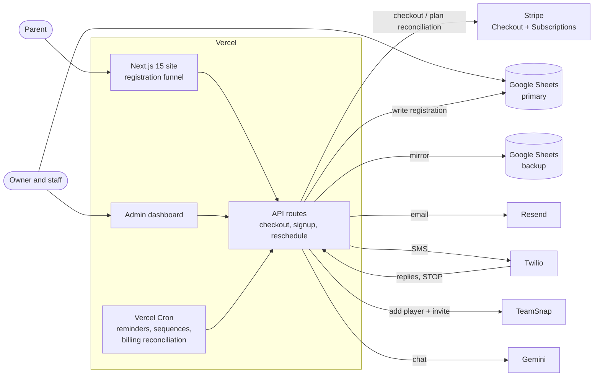
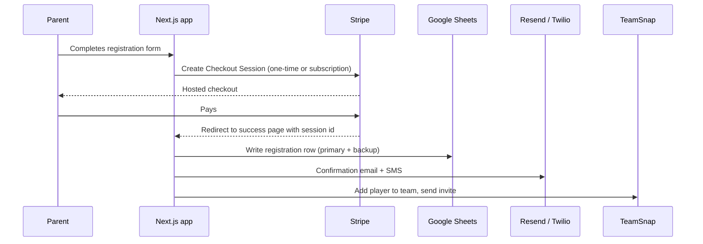

# CYD Soccer Academy: booking and payments platform

A case study of the production platform behind [cydsoccer.com](https://cydsoccer.com), the registration, payments and parent-communication system for a youth soccer academy in Calgary. I'm the sole engineer: I designed it, built it and run it in production.

The production code is private. This repo contains no code from it, only the architecture, the decisions behind it, and what went wrong along the way.

| | |
|---|---|
| **Role** | Sole engineer: design, build, deploy, operate |
| **Timeline** | May 2025 to present |
| **Scale** | ~300 active families across 4 Calgary venues; 1,000+ commits |
| **Stack** | Next.js 15 (App Router), TypeScript, Vercel, Google Sheets API, Stripe, Twilio, Resend, Vercel Cron, TeamSnap API, Gemini |

## The problem

The academy is a brick-and-mortar business: coaches, gyms and fields, and families who need to know where to be and when. It needed bookings, payments and parent communication online, under some real constraints:

- **The operators aren't engineers.** The owner and staff work in spreadsheets. Anything they couldn't read, filter or fix themselves would land back on me.
- **Many families read English as a second language.** Messages and checkout copy have to be short and plain.
- **Every venue runs its own schedule**, with age groups, days and times that change from season to season, and groups that fill up.
- **Families pay in different ways**: in full, in instalments, monthly, or in person.
- **It's a small business.** Every monthly SaaS fee competes with paying a coach.

## What I built

- **Registration funnel.** A multi-step flow (program and venue, then child and parent details, then schedule, then payment) that only offers the age groups, days and payment plans each venue actually runs. Groups can be marked full. All pricing, season dates and payment plans come from one config module, so a price change is a one-line edit instead of a hunt through the site.
- **Payments.** Stripe Checkout for three payment models (pay in full, fixed instalment plans, open monthly subscriptions), plus payment links and a manual-registration screen for families who pay in person.
- **Roster sync.** A paid sign-up is added to the right team in TeamSnap and sent an invite automatically, so coaches see new players without anyone retyping them.
- **Parent communication.** Transactional email and SMS on sign-up; scheduled reminders, follow-ups and abandoned-checkout sequences; and a broadcast composer for schedule changes that shows a live SMS segment and cost count before anything is sent.
- **Self-serve rescheduling.** Parents look up their booking, verify with an SMS code, and request a new slot. Approved changes sync to TeamSnap, and open shifts are offered to available coaches (first to claim gets it), then written to the coach scheduling tool.
- **Operations dashboard.** Registrations, a season roster, reschedule approvals, broadcasts, and marketing analytics (GA4, Search Console and Clarity in one view). A first-touch attribution cookie is carried into Stripe metadata so revenue can be traced back to the channel that brought the family in.
- **Website assistant.** A Gemini-powered chatbot answers common questions and hands the conversation to a human over SMS when it can't.

## Results

- **~300 active families across 4 venues** register and pay online, without staff entering anything by hand.
- **Instalment and subscription billing runs without manual invoicing**, and a daily reconciliation job confirms that plans stop when they're supposed to (see [payment models](#2-stripe-payment-models)).
- **New players reach their team's roster automatically** once they've paid.
- **SMS segments cut by up to 40% on longer notices** by keeping messages in the cheaper GSM-7 encoding (see [the SMS fix](#4-the-gsm-7-vs-ucs-2-sms-fix)).
- **Communications fixed cost of roughly $0–15/month**, against a $97/month floor for the all-in-one platform I evaluated (see [build vs. buy](#3-custom-messaging-stack-instead-of-gohighlevel)).

## Architecture

A paid sign-up, end to end:

Registration writes are guarded per checkout session, so refreshing or reopening the confirmation page can't create a second row.

## Key decisions and tradeoffs

### 1. Google Sheets as the data store (and why Supabase was removed)

The first version dual-wrote every registration to Supabase (Postgres) and to Google Sheets. In late 2025 I removed Supabase and made Sheets the only store, with a second sheet as a live backup.

**Why Supabase came out:**

- **The sheet was already the real source of truth.** The owner and staff run the business from it: they filter it, highlight rows, and fix typos. The Postgres copy was a second record that only I looked at, and the two drifted apart.
- **Running two stores cost more than it gave back.** The free-tier project pauses when it sits idle, so I had to run a keep-alive job, and intermittent fetch errors meant both write paths needed their own failure handling.
- **The scale doesn't need a database.** Each season is hundreds of rows, not millions.

**What Sheets costs, and how I handle it:**

| Limitation | Mitigation |
|---|---|
| No transactions or uniqueness constraints | A short dedupe window on writes, a per-checkout guard on the success page, and server-side rejection of incomplete payloads |
| API rate limits | Writes only happen on real events, and capacity counts are served from a short cache |
| Values are parsed as if typed into the UI, so a phone number starting with `+` becomes a broken formula | User text that can start with `+`, `=`, `-` or `@` gets Sheets' literal-text prefix before it's written |
| The header row is the schema, so adding a field touches several places | Season-scoped tabs keep each season's columns stable |
| A sheet can be edited by hand at any time | Anything that moves money reads Stripe, not a sheet cell |

**When I'd change it:** once the business needs relational queries across seasons, or concurrent writers become common, I'd move to Postgres and keep Sheets as a read-only view for staff.

### 2. Stripe payment models

| Model | Used for | How it works |
|---|---|---|
| **Pay in full** | Season registration | One-time Checkout payment, discounted against the plan total |
| **Instalments** | Season registration | A monthly Stripe subscription that has to stop after a fixed number of payments |
| **Open monthly subscription** | 1-on-1 training | Billed monthly until cancelled; paying up front gets a month free |
| **Payment links + manual entry** | In-person sales | Pre-built payment links, plus an admin screen that registers a family who paid offline without charging a card |

**The tradeoff that mattered: push vs. pull.** Stripe has no native "charge exactly N times" for a subscription, so something has to cancel the plan after the last instalment. The first design did this in a webhook handler: count the paid invoices and stop at the limit. The logic was correct, but a webhook only runs if Stripe can reach it, and when it isn't firing nothing alerts you. That's how some plans billed past their end date before it was caught.

The fix was to stop waiting to be told. A daily job asks Stripe which plans have finished and cancels them. It shipped in report-only mode, emailing what it *would* do, and only started acting after a few reports matched expectations. The general rule I took from it: a system that waits for a push fails silently, and a system that pulls fails loudly.

### 3. Custom messaging stack instead of GoHighLevel

The obvious choice for a small business is an all-in-one CRM like GoHighLevel: email, SMS, workflows and a contact database in one product. I built it on Resend (email), Twilio (SMS) and Vercel Cron (scheduling) instead.

| | GoHighLevel | Custom (Resend + Twilio + Cron) |
|---|---|---|
| Fixed monthly cost | $97/month minimum | ~$0–15/month |
| Per-message SMS cost | Paid on top | Paid on top |
| Workflow builder | Visual, no code | Code, reviewed and versioned in git |
| Access to registration and payment data | Through syncs and integrations | Direct: workflows read Stripe and the sheet themselves |

**What I gave up:** a visual workflow builder the owner could edit, and a ready-made CRM inbox. I also own deliverability, opt-out handling (Twilio's STOP status is surfaced as "opted out" instead of a generic failure) and retries.

**What I got:** automations that act on real payment state. The lead-nurture SMS sequence stops as soon as Stripe shows the family has paid. A marketing guard keeps registered families out of promotional sends and caps everyone at about one email a day. And cost control down to the segment, which led to the next fix.

### 4. The GSM-7 vs. UCS-2 SMS fix

Carriers bill SMS per **segment**, not per message, and the encoding decides how long a segment is:

| Encoding | Single segment | Each segment when split |
|---|---|---|
| GSM-7 | 160 characters | 153 characters |
| UCS-2 | 70 characters | 67 characters |

One character outside the GSM-7 set switches the **whole message** to UCS-2. That includes a curly apostrophe from an iPhone keyboard, an em dash pasted from a doc, or a single emoji. A 320-character schedule notice goes from 3 segments to 5, and that's multiplied across every family on the list.

The fix had three parts:

1. **A sanitizer.** Smart quotes, dashes, ellipses, non-breaking and zero-width spaces are converted to their GSM-7 equivalents, accented letters are folded where possible, and emoji are removed.
2. **A live counter in the broadcast composer.** It shows the segment count and cost, and which characters it replaced, before anyone hits send.
3. **The same check on the server.** The API recomputes segments instead of trusting the number the browser shows.

A second, separate fix in the same pass: outbound texts were going through Twilio's Conversations API, which adds a per-message fee on top of the SMS itself. Moving outbound sends to the plain Messages API removed that fee. Conversations is still used where it earns its keep: the admin inbox and chatbot handoff.

## Smaller lessons

- **Time zones are data, and data goes stale.** Alberta moved to permanent UTC−6, and the time zone data bundled with the runtime didn't know yet, so date math was an hour off for winter dates. All local-time math now goes through one module with an explicit offset, and calendar writes to TeamSnap use a zone that already matches it.
- **Confirmation pages get refreshed.** An early version re-saved the registration every time the success page loaded, so a back button or a reopened tab created a duplicate. The page now remembers which checkout sessions it has already saved, and the server rejects half-empty payloads.
- **"Paid" lives in Stripe.** Sheet columns record what a family *signed up for*; only Stripe knows what they've actually paid. Billing reconciliation and the payments admin views read Stripe directly.

## Screenshots

> Screenshots are blurred to protect family information.

| View | Screenshot |
|---|---|
| Registration: choose program and venue | _coming soon_ |
| Checkout: payment plan selection | _coming soon_ |
| Admin: season roster | _coming soon_ |
| Broadcast composer with live segment counter | _coming soon_ |
| Parent SMS confirmation | _coming soon_ |

## Links

- Live site: [cydsoccer.com](https://cydsoccer.com)
- Author: Abdelrahman Mohamed · [LinkedIn](https://www.linkedin.com/in/abdelrahman-mohamed-080488197/) · abdel.mohamed.engineer@gmail.com
